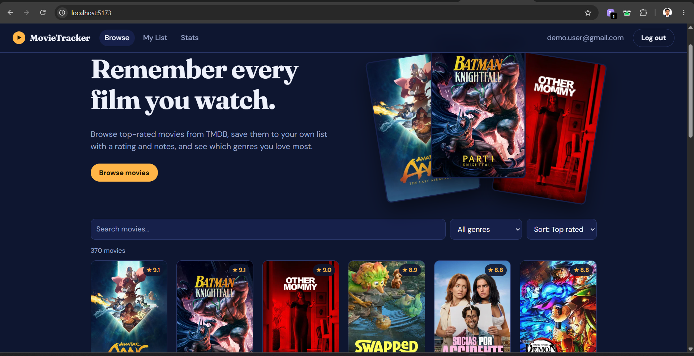
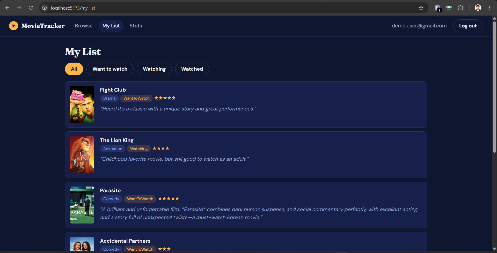
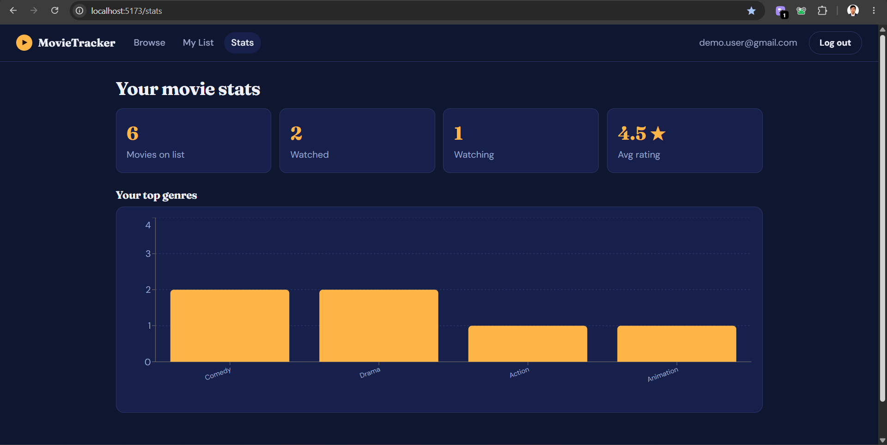

# MovieTracker

A full-stack web app for keeping a personal movie diary. Browse top-rated movies imported from TMDB, save them to your own list with a status, rating and notes, and see which genres you watch most.

| Movie detail | My List | Stats |
|---|---|---|
|  |  |  |

## Features

- Browse movies with search, genre filter, sorting (top rated, newest, title) and server-side pagination
- Register and log in with JWT authentication; each user only sees their own list
- Save a movie as *Want to watch*, *Watching* or *Watched*, with a 1–5 rating and notes
- Stats page with totals, average rating and a top-genres chart
- Background service that imports movies from the TMDB API on startup and then every 24 hours
- Responsive layout with loading skeletons and keyboard-friendly focus styles

## Tech stack

| Layer | Technology |
|---|---|
| Backend | ASP.NET Core Web API, Entity Framework Core, JWT bearer auth, BCrypt, Swagger |
| Database | SQL Server (migrations managed with EF Core) |
| Frontend | React, React Router, Vite, Recharts |
| External data | TMDB API |

## Architecture

```
TMDB API --> Background importer --> SQL Server <-- EF Core <-- ASP.NET Core Web API <-- React (Vite)
              (every 24 hours)                                   (JWT auth, REST)
```

Design decisions:

- **Import into my own database** instead of calling TMDB from the browser. This keeps the API key private, avoids rate limits, and allows joining movie data with user data for stats.
- **Upsert by `TmdbId`**, so the importer can run repeatedly without creating duplicates.
- **Server-side filtering and pagination** with `Skip`/`Take` so the browser never downloads the whole table.
- **User id comes from the JWT claims**, never from the request body, so one user can't read another user's list.
- **Unique indexes** prevent duplicate emails, duplicate TMDB ids and duplicate list entries.

## Getting started

### Prerequisites

- .NET SDK 8 or newer
- Node.js 18 or newer
- SQL Server (LocalDB, SQL Server Express or Docker)
- A free TMDB account for an API key

### 1. Get a TMDB API key

Create an account at https://www.themoviedb.org, then go to **Settings → API** and copy the **API Key (v3 auth)**.

### 2. Run the API

```bash
cd api
dotnet tool install --global dotnet-ef                  # once
dotnet user-secrets init                                # once
dotnet user-secrets set "Tmdb:ApiKey" "YOUR_KEY_HERE"   # keeps the key out of git
dotnet user-secrets set "Jwt:Key" "a-long-random-secret-of-at-least-32-characters"
dotnet restore
dotnet ef migrations add InitialCreate                  # once, if api/Migrations is missing
dotnet run
```

- API and Swagger UI: http://localhost:5080/swagger
- The console shows `Imported N new movies from 'popular'` when the import runs.

**Database connection.** The default connection string in `api/appsettings.json` uses SQL Server LocalDB. Change `ConnectionStrings:Default` if you use something else:

```
# SQL Server Express
Server=localhost\\SQLEXPRESS;Database=MovieTracker;Trusted_Connection=True;TrustServerCertificate=True

# Docker
Server=localhost,1433;Database=MovieTracker;User Id=sa;Password=Your_strong_Passw0rd;TrustServerCertificate=True
```

To run SQL Server in Docker:

```bash
docker run -e ACCEPT_EULA=Y -e MSSQL_SA_PASSWORD='Your_strong_Passw0rd' -p 1433:1433 -d mcr.microsoft.com/mssql/server:2022-latest
```

### 3. Run the React app

```bash
cd client
npm install
npm run dev
```

Open http://localhost:5173. The Vite dev server proxies `/api` requests to the API on port 5080.

## API summary

| Method | Route | Auth | Purpose |
|---|---|---|---|
| POST | `/api/auth/register`, `/api/auth/login` | No | Returns a JWT |
| GET | `/api/movies?search&genre&sort&page` | No | Search, filter, sort and paginate |
| GET | `/api/movies/genres`, `/api/movies/{id}` | No | Genre list and movie details |
| GET | `/api/mylist?status` | Yes | My saved movies |
| GET, PUT, DELETE | `/api/mylist/{movieId}` | Yes | Read, save (status, rating 1–5, notes) or remove an entry |
| GET | `/api/stats` | Yes | Totals and top genres |

## Project structure

```
api/       ASP.NET Core Web API (Controllers, Models, Data, Services, Migrations)
client/    React app (src/pages, src/auth.jsx, src/api.js)
```

## Roadmap

- Automated tests: xUnit with `WebApplicationFactory` for the API, Vitest for the client
- Many-to-many genres (each movie currently stores one primary genre)
- httpOnly cookie auth with refresh tokens
- Docker Compose setup and CI with GitHub Actions
- Deployment to Azure (App Service, Azure SQL, Static Web Apps)

## Credits

Movie data and images come from [TMDB](https://www.themoviedb.org). This product uses the TMDB API but is not endorsed or certified by TMDB.
